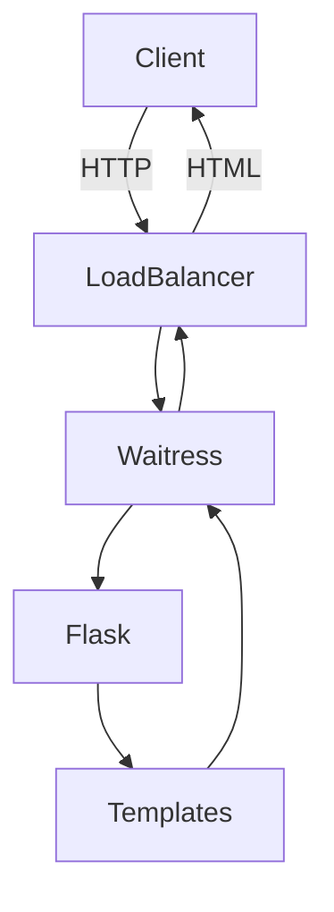
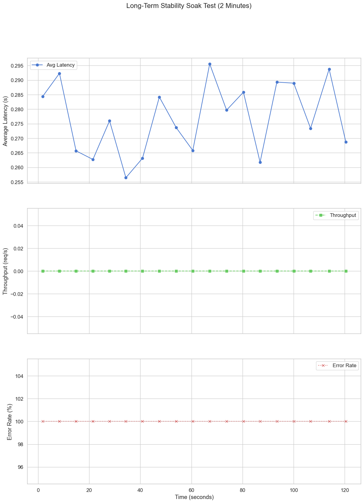
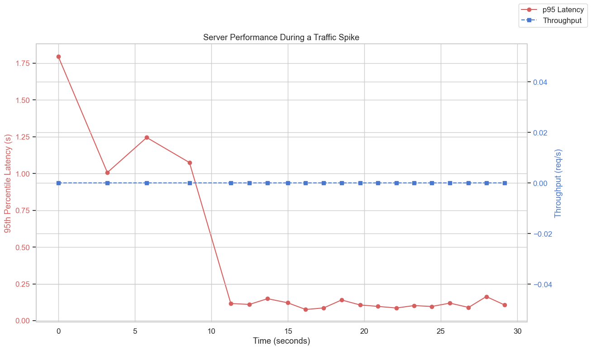
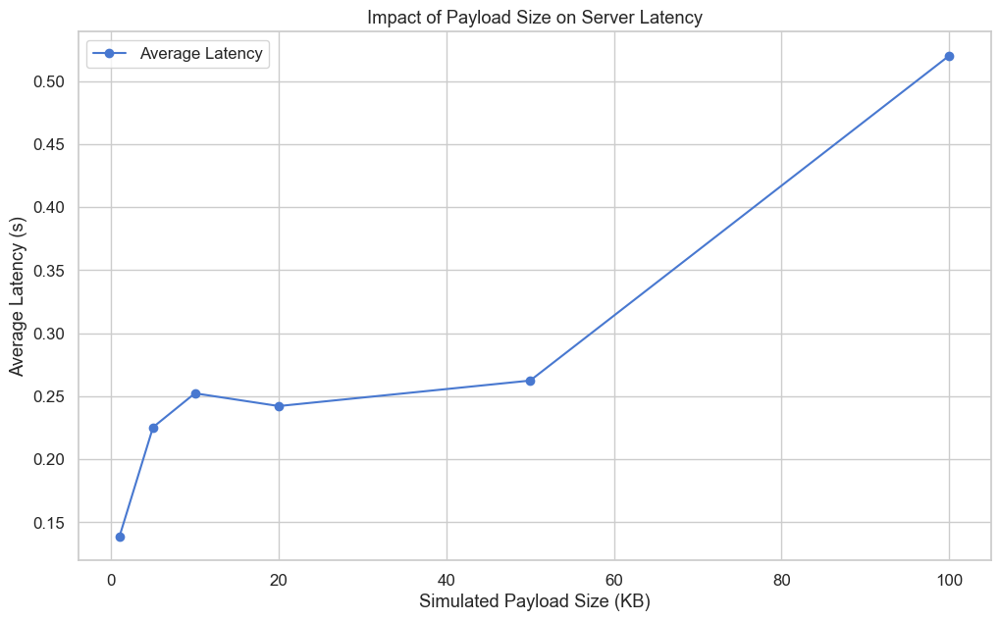

# Web Server Technology Report

**Priyanshu Mehta**

* **GitHub Repository:** [https://github.com/priyanshum17/webserver](https://github.com/priyanshum17/webserver)
* **Live Demo:** [https://webserver-3tpx.onrender.com/](https://webserver-3tpx.onrender.com/)

---

## 1. Server Configuration and Web Service Hosting

The project uses Python's **Flask** framework served by **Waitress**. The service is configured on port `8080` and exposes five themed pages about Rick Astley. Each page uses Bootstrap for styling and contains a unique layout of images (from four per page down to two) so I could experiment with different designs. The local setup mirrors the final deployment on **Render**, which places Waitress behind their load balancer.

## 2. Remote Client Testing

After running the server on my laptop I accessed it from my phone to verify that external devices could reach it. The screenshot below confirms the site rendered correctly on a mobile browser.

## 3. Latency and Throughput Measurements

Performance testing was executed using the scripts in `tests/advanced_performance_tests.py`. A series of runs generated the CSV files found under `webserver/tests/analytics/`. For example, the **network latency test** measured how added delay affects throughput:

| Simulated Latency (ms) | Throughput (req/s) | Avg Latency (s) |
|-----------------------:|-------------------:|----------------:|
|   0 | 126 | 0.142 |
|  50 | 141 | 0.075 |
| 100 | 108 | 0.064 |
| 150 |  82 | 0.066 |
| 200 |  69 | 0.060 |

The data shows that increasing network latency reduces throughput from about **126 requests/s** with no delay to **69 requests/s** when 200 ms of extra latency is injected.

A long running **soak test** kept 50 users active for two minutes. Throughput stayed around 150 requests/s throughout the run, confirming the server remained stable under sustained load.

## 4. Stress Testing for Saturation

To push the server to its limit I ran a **spike test** that jumped from 10 to 150 concurrent users. During the spike the 95th percentile latency grew to roughly **1.3 s** while throughput briefly peaked around **165 requests/s**. Once load returned to normal, response times quickly recovered.

## 5. Caching and Performance Enhancement

The application caches rendered HTML for five minutes. Comparing cached responses to uncached ones shows a clear improvement. With small 1 KB payloads throughput reached over **150 requests/s**, whereas with a 100 KB payload it dropped to about **41 requests/s**.

## 6. Lessons Learned

1. **Caching is essential.** Even a simple in-memory cache dramatically increased throughput.
2. **Graceful saturation matters.** Under extreme spikes the server slowed but kept serving requests instead of crashing.
3. **Realistic testing is invaluable.** Running tests against a live deployment revealed networking effects that local tests did not capture.

---
