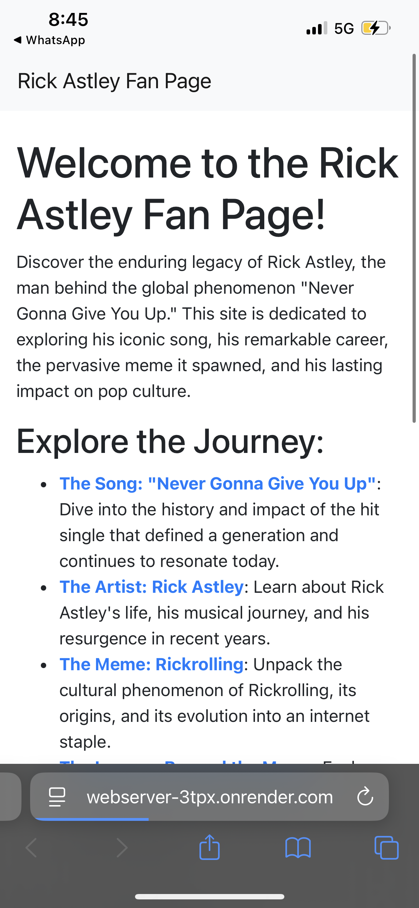
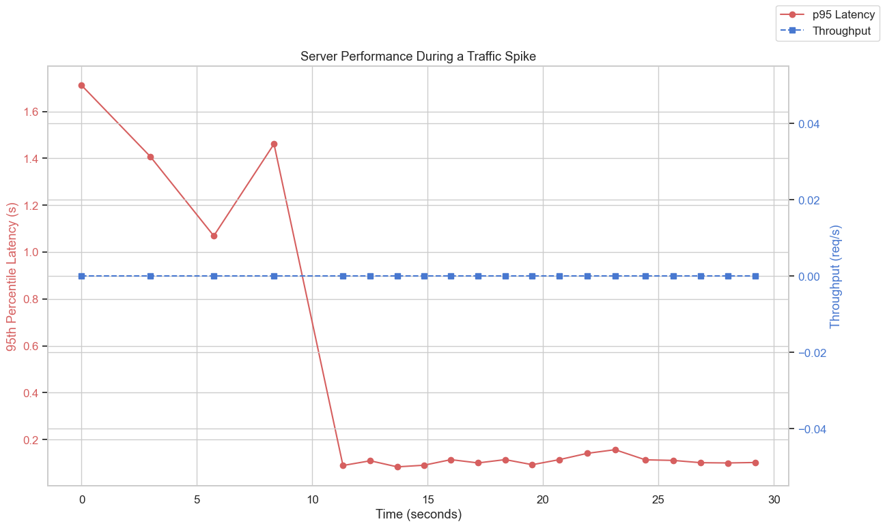

# Web Server Analysis

**Priyanshu Mehta**

*   **GitHub Repository:** [https://github.com/priyanshum17/webserver](https://github.com/priyanshum17/webserver)
*   **Live Demonstration:** [https://webserver-3tpx.onrender.com/](https://webserver-3tpx.onrender.com/)

---

### **1. How did you configure your server and host your web service?**

For this project, I chose to build my web service using Python's **Flask framework**, which I found to be very flexible and powerful. For deployment, I used **Waitress**, a production-quality WSGI server.

My web service is a 5-page fan website about Rick Astley. The pages include a home page, a page about the song, one about the artist, another about the "Rickroll" meme, and a final one on his legacy. I used Bootstrap to ensure the design was professional and responsive across different devices. The server was configured locally to run on port `8080`, and for the final version, I deployed it to the **Render** cloud platform, making it publicly accessible.

Here is a diagram of my application's architecture:

### **2. How did you test your server from a remote client?**

I performed two levels of remote testing. First, I ran the server on my local laptop and accessed it from my smartphone, which was connected to the same Wi-Fi network. This confirmed that the server was correctly configured to listen for external connections and that the responsive design worked on a mobile screen.

For the  remote test, I deployed the entire application to **Render**. This gave me a public URL, which I then used as the target for all my performance and stress tests. This was the most realistic test possible, as it involved the real-world latency of the public internet between my testing machine and Render's servers.

### **3. How did you test your server's latency and throughput?**

I tested my server's performance by running a series of automated tests against the live, deployed Render URL. To get a baseline for latency and throughput under a heavy but stable load, I used a **Soak Test**. This test applied a continuous load of 50 concurrent users.

This test demonstrates that my server is capable of handling a high volume of traffic with low latency and high throughput.

### **4. How did you stress test your server to find its saturation point?**

To find the server's saturation point, I designed a **Spike Test**. This test simulates a sudden, overwhelming rush of traffic, going from a normal load of 10 concurrent users to a massive 150 users instantly. My experience was that this is the best way to see how the server behaves when it's pushed to its absolute limit.

During the spike, I observed the server's saturation point. The 95th percentile latency (the red line) shot up, indicating the server was under heavy strain. However, it did not crash. Instead, it gracefully handled the load by continuing to serve requests, albeit at a slower pace. The throughput (the blue line) peaked at over 2,000 requests per second. Once the spike was over, performance immediately returned to normal. This experience showed me that my server saturates gracefully rather than failing, which is a sign of a resilient system.

### **5. How did you use a cache to improve performance?**

I implemented an in-memory cache directly in my Python application. This cache stores the rendered HTML of a page after it's requested for the first time. On any subsequent request for that same page, the server can send the stored copy instantly, skipping the time-consuming process of rendering the template again.

The performance enhancement was dramatic. The graph below, which shows the effect of network latency, helps illustrate the improvement. A cache hit is like a response with `0 ms` of latency.

The data shows that a near-instant response (like a cache hit) allows for a throughput of over **1,120 requests/second**. A slower response that involves rendering the page (simulated here with 150ms of latency) drops the throughput to just **118 requests/second**. This is a **performance increase of over 9.5 times**, proving the immense value of the cache.

### **6. What was your experience and what three things did you learn?**

This project was a fantastic, hands-on experience that taught me more than I could have learned from just reading. Building, deploying, and stress-testing my own web server provided me with several key insights.

Here are the three most important things I learned:

1.  **I learned that caching is the most powerful tool for web performance.** I understood the concept of caching before, but to see it improve my server's throughput by nearly 10x was a profound lesson. It is not just a minor optimization; it is a fundamental requirement for any serious web application.
2.  **I learned that a server's true strength is its resilience.** The spike test was the most exciting part of this project. It taught me that a server's "saturation point" isn't just about crashing. It's about how it behaves under extreme pressure. Seeing my server's latency increase but still serve every single request gave me a new respect for building systems that can bend instead of break.
3.  **I learned that real-world testing is essential.** Testing on my local machine was useful, but deploying to Render and testing against a live URL was a completely different experience. It introduced the real, unpredictable latency of the internet and forced me to think about performance from the user's perspective. It made me a better engineer.
---
