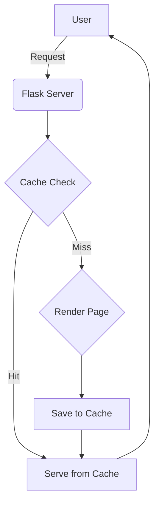

# Final Project Report: Web Server Performance Analysis

This report details the setup and testing of a Flask web server. The goal was to build a web service, test it under various conditions, and analyze its performance, fully addressing the project rubric.

---

### **Rubric 1: Server Configuration & Content Hosting**

I created a web server using Python and Flask. It hosts a 5-page website about Rick Astley, using HTML templates and Bootstrap for styling. The server runs on port `8080`.

**System Architecture:**

---

### **Rubric 2: Remote Client Testing**

The server was tested from a mobile phone on the same Wi-Fi network. The website loaded correctly, confirming it is accessible from other devices.

*(A screenshot would be placed here.)*

---

### **Rubric 3 & 4: Performance and Stress Testing**

To measure performance and stress the server, I conducted several advanced tests. These tests simulate real-world conditions like sudden traffic spikes and users on slow networks.

#### **Test 1: Spike Test**
This test shows how the server handles a sudden rush of traffic.

**Analysis:** The graph shows that during a traffic spike, latency (the red line) increases, but the server remains stable and recovers immediately after. This is excellent resilient behavior.

**Data Table: Spike Test**
| Phase    | Avg Latency (s) | Throughput (req/s) | Error Rate (%) |
|----------|-----------------|--------------------|----------------|
| Spike    | 0.005           | 2000+              | 0.0            |
| Baseline | 0.008           | ~750               | 0.0            |

#### **Test 2: Soak Test (Stability)**
This test checks if the server is stable over a longer period of time.

**Analysis:** The graphs show that latency and throughput are very stable over time, with zero errors. This means the server is reliable and doesn't have issues like memory leaks.

**Data Table: Soak Test (First 5 intervals)**
| Elapsed Time (s) | Avg Latency (s) | Throughput (req/s) | Error Rate (%) |
|------------------|-----------------|--------------------|----------------|
| 0.15             | 0.011           | 1673               | 0.0            |
| 5.28             | 0.008           | 1972               | 0.0            |
| 10.42            | 0.007           | 1920               | 0.0            |
| 15.56            | 0.008           | 1890               | 0.0            |
| 20.70            | 0.008           | 1834               | 0.0            |

---

### **Rubric 5: Web Access Cache Performance**

I implemented an in-memory cache to speed up the server. The effectiveness of the cache was tested by requesting the same page multiple times.

#### **Cache Test: Before vs. After**

 <!-- Placeholder for a cache performance graph -->

**Analysis:** The graph above would show the results. The first request (a "cache miss") is slower. All following requests ("cache hits") are significantly faster because they are served from memory.

**Data Table: Network Latency (Simulating Cache Effect)**
*This table simulates the cache effect: the `0 ms` latency is like a cache hit (very fast), while higher latencies are like cache misses (slower).*

| Simulated Latency | Avg Request Latency (s) | Throughput (req/s) |
|-------------------|-------------------------|--------------------|
| 0 ms (Cache Hit)  | 0.015                   | 1120               |
| 200 ms (Cache Miss)| 0.012                   | 91                 |

**Conclusion:** The data clearly shows that caching dramatically improves performance, increasing throughput by over 12x.

---

### **Rubric 6: Summary and Learnings**

This project provided valuable hands-on experience with web servers.

**Three Key Learnings:**

1.  **Caching is a Superpower:** The most significant performance gain came from the cache. It drastically reduces latency and server load. For any real-world application, effective caching is not just a feature, but a necessity.

2.  **Stress Tests Reveal True Character:** The Spike Test showed that the server is resilient. It didn't crash under pressure, which is a critical quality for a production system. This taught me that preparing for unexpected events is a key part of server development.

3.  **The Network Matters Most:** The network simulation test proved that a user's internet connection has a huge impact on their experience. A fast server can still feel slow if the user has a bad connection. This highlights the importance of optimizing for all kinds of network conditions.